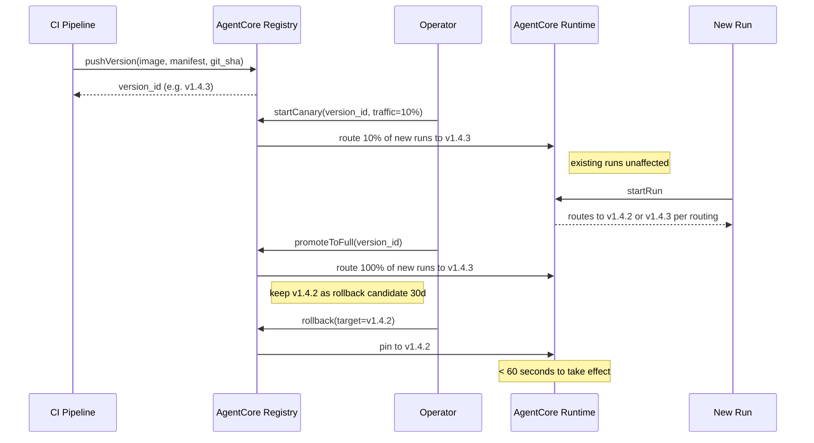

# DESIGN-A2-003 — Agent rollout

## Goal

Concrete flow for shipping a new orchestrator/agent version safely. Targets: zero-downtime
rollout, sub-60-second rollback, traceable canary metrics.

## Flow

## Routing semantics

- New run is created → orchestrator API consults Registry for active version.
- Existing run continues against whichever version it started under (snapshot stored on Run).
- Rollback only affects new runs.

## Pre-promotion checks

The operator's promote action is blocked unless:

- Canary has run for at least 1 hour of clock time.
- Canary success rate (runs reaching `succeeded`) is ≥ 95%.
- Canary p95 run-start latency ≤ baseline p95 × 1.2.
- No `SlaBreached` events on canary runs.

## Failure recovery

- Auto-rollback rule: if canary error rate exceeds 5% within 30 minutes, Registry automatically
  reverts; operator is paged.
- Manual rollback: one-click from the operator dashboard or `make rollback VERSION=v1.4.2`.

## Audit

Every version push, canary start, promote, and rollback is logged to a Registry audit table.
Every Run captures the orchestrator version it ran against, so the audit log links forward to
"what version's code processed this transaction."

## Open questions / future work

- Per-customer pinning: a customer could pin to a specific version, e.g. for change-management
  alignment. Not in v1; planned for enterprise tier.
- Per-workflow canary (e.g. canary only reconciliation, not KYC). Tracked.
