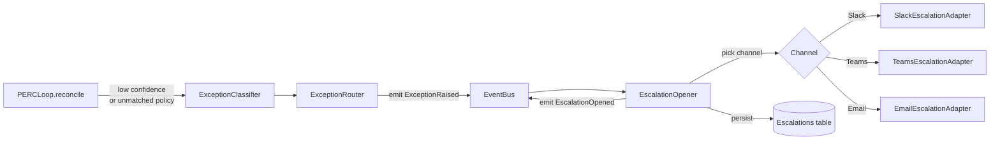

# DESIGN-A2-004 — Exception detection and escalation routing

## Goal

A clear path from "the Reasoner is unsure" to "a named human reviewer has the case in front of
them with the right context."

## Pipeline



## Classification logic

`ExceptionClassifier` is pure (`src/domain/`). Inputs:

- The Reasoner's reconcile decision (with confidence).
- The step result.
- The workflow's `exception_categories`.

Output: an `Exception` value with `category`, `severity`, and `reasoner_summary`.

Severity defaults:

| Category | Severity |
|---|---|
| `amount_mismatch` ≤ 1% | low |
| `amount_mismatch` > 1% | medium |
| `missing_invoice` | medium |
| `duplicate_payment` | high |
| `currency` | medium |
| `unknown` | high |

Severity may be customized per workflow.

## Channel selection

```python
def select_channel(workflow, severity) -> Channel:
    # Workflow-declared override
    if severity in workflow.escalation.overrides:
        return workflow.escalation.overrides[severity]
    return workflow.escalation.channel  # default
```

## SLA tracking

A separate Lambda subscribes to `EscalationOpened`:

1. Computes deadline = `opened_at + reviewer_sla_minutes`.
2. Writes a DDB record with TTL at deadline.
3. On TTL expiry, a Step Functions wait state fires `SlaBreached`, which the email fallback
   channel listens to.

## Escalation message contents

Every Slack/Teams message includes:

- Workflow + run link to the dashboard.
- The Reasoner's narrative summary (one paragraph).
- The relevant step context (key fields, not the full payload).
- Up to 3 screenshots if attached to the step.
- One-click buttons: Approve / Reject / Open in Dashboard.

Approve/Reject hit the `resolveEscalation` API. "Edit" requires the dashboard surface.

## Failure modes

| Failure | Mitigation |
|---|---|
| Slack channel deleted by customer admin | Per-customer escalation channel health check; fallback to email |
| Customer Slack workspace tokens expired | Refresh prompt to operator; pause workflows that depend on Slack |
| Reviewer never resolves | SLA breach → email fallback; if email also unanswered for 24h, send weekly digest to customer admin |
