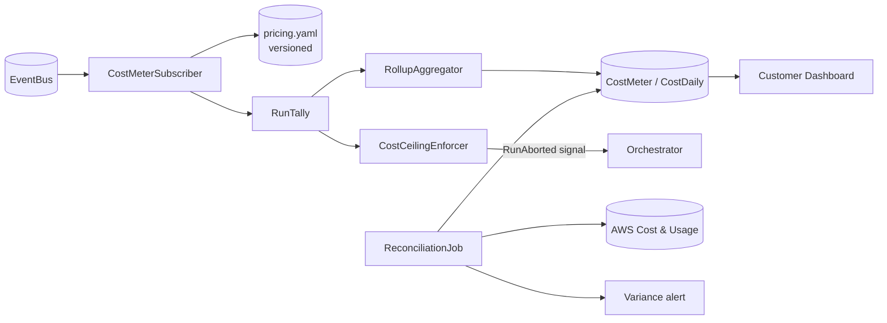

# DESIGN-A2-006 — Cost meter

## Goal

Translate raw model and runtime usage events into per-run, per-agent, and per-workflow cost
figures that drive both customer dashboards and the cost-ceiling enforcer, with auditable
reconciliation against AWS billing.

## Components



## Pricing source-of-truth

`config/pricing.yaml`:

```yaml
version: 2026-05-01
bedrock:
  anthropic.claude-opus-4-6:
    input_tokens_per_million_usd: 5.00
    output_tokens_per_million_usd: 25.00
    cached_input_fraction_cost: 0.10
novaact:
  agent_hour_usd: 4.75
agentcore_browser:
  hour_usd: 2.40
agentcore_runtime:
  vcpu_hour_usd: 0.012
  memory_gb_hour_usd: 0.0013
```

Updated by PR; version bump required on every change. The cost meter records the pricing
version used per event, so a price change does not retroactively alter historical figures.

## Per-run tally

The subscriber maintains an in-memory tally for each active run. On every event:

1. Compute `cost_delta` from event fields × pricing.
2. Add to `run_total`.
3. Emit `CostMetered` event if a threshold (default every 30s or every $0.10) is crossed.
4. Write incremental update to DDB `CostMeter` row.

On `RunCompleted` or `RunAborted`, the final tally is written to S3 inside the run bundle.

## Rollups

A background process aggregates per-customer daily totals into a separate `CostDaily` DDB
table (or Athena view over the S3 audit copies). Used by the dashboard's 30-day view.

## Cost ceiling enforcement

A separate subscriber (`CostCeilingEnforcer`):

1. Watches `CostMetered` events.
2. Compares running tally against `workflow.budget.max_cost_per_run_usd`.
3. On breach, writes a `ceiling_breached=true` DDB attribute on the run.
4. Orchestrator polls between steps and respects the attribute → aborts run cleanly.

A hard secondary ceiling (2× the configured) acts as a kill switch in case the soft ceiling is
missed.

## Reconciliation

Weekly job in `scripts/reconcile_costs.py` produces a variance report. See `NFR-COST-002`.

## Edge cases

- Long-running steps cross the `CostMetered` boundary: emit at fixed time intervals to avoid
  end-of-run surprise.
- Cached prompt fractions are reported by Bedrock; pricing.yaml uses them directly.
- Nova Act wait time (Human-in-the-Loop) is not billed; ensure tally excludes wait time.
