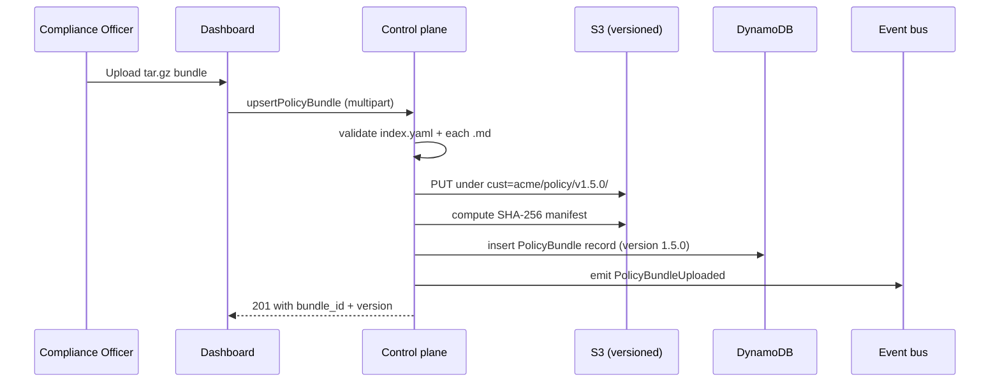

# DESIGN-A2-008 — Policy bundle workflow

## Goal

A versioned, hash-verified pipeline for ingesting the customer's policy markdown bundle into
the Reasoner's cached prompt context.

## Bundle anatomy

A policy bundle is a directory of markdown files plus an `index.yaml`:

```
policy/acme/2026-05/
├── index.yaml
├── three_way_match.md
├── journal_posting_rules.md
├── tolerance_definitions.md
└── escalation_categories.md
```

`index.yaml`:

```yaml
bundle_name: acme-reconciliation-policies
version: 1.5.0
effective_from: 2026-05-15
documents:
  - three_way_match.md
  - journal_posting_rules.md
  - tolerance_definitions.md
  - escalation_categories.md
metadata:
  approved_by: bsa.officer@acme.bank
  approved_at: 2026-05-14T17:23:00Z
```

## Upload pipeline



## Validation

- Every referenced `.md` file exists.
- Files are valid UTF-8.
- Total bundle size ≤ 5MB (Bedrock prompt-cache prefix size constraint).
- No file references images or external URLs (we keep prompts self-contained).
- `effective_from` is not in the past more than 30 days (catches typos).

## Activation

- A bundle becomes "active" only after explicit activation, not on upload.
- Activation is a separate API call requiring `customer:write` scope.
- Active bundle is referenced by workflow `policy_documents` field — version is pinned per
  workflow, not floating.

## Runtime consumption

- On run start, the Reasoner adapter loads the bundle's `.md` files concatenated in `index.yaml`
  order into the cached prompt prefix.
- Bundle hash is recorded on the run record. The audit log shows "policy bundle 1.5.0, hash X
  was applied to this run."

## Rollback

- An operator (or compliance officer with override) can pin a prior bundle version as active.
- Pinning is itself audit-logged.
- In-flight runs continue against their pinned version.

## Customer admin UX

The dashboard surface (`web/app/(customer)/policy-bundles/page.tsx`):

- List of versions with timestamps and approver.
- Diff view between two versions (markdown diff, highlighting tolerance changes).
- "Activate" button with confirmation modal that surfaces the diff.
- Upload UI with progress and validation feedback.
