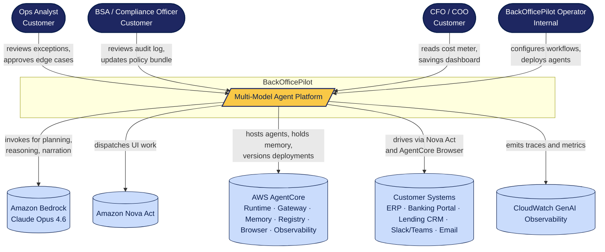

# C4 Level 1 — System Context

The system-context view shows BackOfficePilot as a black box and the people and external systems
that interact with it.

## Actors

| Actor | Role | What they need from BackOfficePilot |
|---|---|---|
| **Ops Analyst** | Day-to-day operations staff at the customer | Get a clean queue of exceptions, approve or correct fuzzy matches, see what the agent did and why. |
| **BSA / Compliance Officer** | Customer's regulatory officer | Confirm policy is applied correctly, export audit logs, update the policy bundle. |
| **CFO / COO** | Executive sponsor at the customer | See savings, see cost-per-agent and cost-per-workflow, compare against historical labor cost. |
| **BackOfficePilot Operator** | Internal staff (initially the founder) | Onboard customers, configure workflows, deploy and monitor agents. |

## External systems

| System | Role |
|---|---|
| **Amazon Bedrock** | Hosts Claude Opus 4.6, our Reasoner. Invoked for planning, exception classification, and narration. |
| **Amazon Nova Act** | Primary Executor. Drives browser and desktop UI for customer systems. |
| **AWS AgentCore** | The runtime substrate. Six services: Runtime (host), Gateway (tools/APIs), Memory (session+long-term context), Registry (versions), Browser (sandboxed UI host, our fallback Executor), Observability (traces/metrics). |
| **Customer Systems** | ERPs (NetSuite, Sage), banking portals, lending CRMs, Slack/Teams (for escalation), email. Reached through Nova Act or AgentCore Browser; no direct API integration in v1. |
| **CloudWatch GenAI Observability** | AWS-managed dashboarding surface. Consumes AgentCore Observability output. |

## Notes

- "Customer Systems" deliberately includes Slack/Teams: the agent escalates exceptions there.
  Slack/Teams are treated as just another UI the Executor drives.
- We have no direct database integrations into customer ERPs. This is by design (ADR-002, ADR-011)
  — UI-level integration is what makes the product work on systems with no usable API.
- The diagram excludes our own admin UI (Next.js dashboard) since it's part of "BackOfficePilot."
  It appears in the container view (`DESIGN-C4-002`).
