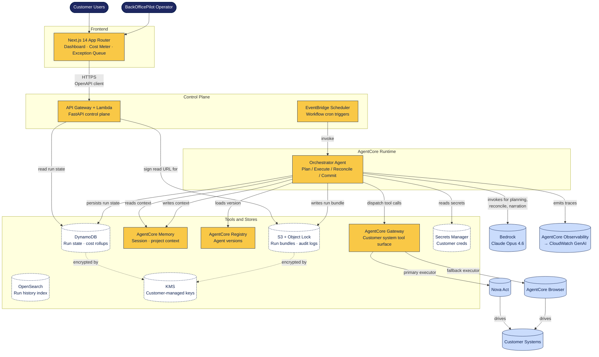

# C4 Level 2 — Containers

The container view shows the deployable units inside BackOfficePilot. Each box is a separate
process or service.

## Containers

| Container | Tech | Responsibility |
|---|---|---|
| **Next.js 14 Dashboard** | Next.js App Router + TS + Tailwind + shadcn/ui | Customer-facing UI: cost meter, exception queue, run history, audit replay. |
| **API Gateway + Lambda (control plane)** | FastAPI on Lambda behind API Gateway | Reads run state, signs S3 URLs, manages workflow definitions, exposes the OpenAPI surface to the dashboard. |
| **EventBridge Scheduler** | EventBridge cron rules | Triggers workflow runs on schedule (e.g. daily reconciliation at 07:00 CT). |
| **Orchestrator Agent** | Python (FastAPI / pure orchestration loop) on AgentCore Runtime | Runs the PERC loop: plan, execute, reconcile, commit. One instance per customer per workflow. |
| **AgentCore Gateway** | AWS managed | Translates customer APIs / MCP servers / Nova Act / AgentCore Browser into agent-callable tools. |
| **AgentCore Memory** | AWS managed | Per-session and long-term memory store the orchestrator reads/writes between steps. |
| **AgentCore Registry** | AWS managed | Source of truth for orchestrator version; supports canary and rollback. |
| **DynamoDB** | AWS managed (single-table design) | Run state, cost rollups, escalation timers. Hot-path reads. |
| **S3 + Object Lock** | AWS managed | Immutable run bundles, audit logs, screenshots. |
| **OpenSearch** | AWS managed | Search across run history (customer-facing search). |
| **Secrets Manager** | AWS managed | Customer-system credentials. Rotated. |
| **KMS** | AWS managed | Customer-managed keys for at-rest encryption. |
| **External: Bedrock** | AWS managed | Hosts Claude Opus 4.6. |
| **External: Nova Act** | AWS managed | Primary Executor. |
| **External: AgentCore Browser** | AWS managed | Fallback Executor. |
| **External: Observability → CloudWatch** | AWS managed | Trace and metric pipeline. |

## Deployment boundaries

- Every container above lives inside a **single AWS account per environment** (`ADR-009`).
- Prod and UAT are mirror deployments, distinct accounts, distinct VPCs.
- The Next.js dashboard runs on Vercel or AWS Amplify; treat it as the only resource outside the
  VPC. It reaches the control plane through API Gateway with Cognito/JWT auth.

## Hot paths

- **Workflow run**: Scheduler → Orchestrator → (Bedrock + Gateway + Memory + Customer Systems) → S3 + DDB + Observability.
- **Dashboard load**: User → Next.js → API Gateway → Lambda → DDB → S3 (signed URLs for artifacts).
- **Exception escalation**: Orchestrator → Slack/Teams (via Gateway/Executor) → human → API Gateway → DDB update → Orchestrator resumes.

## Why the control plane is separate from the agent runtime

The control plane is a stateless CRUD-style API. Lambda + API Gateway is ideal for it. The
agent runtime is a long-running orchestration loop with side-effects. AgentCore Runtime is ideal
for it. Mixing them in one container would force one to compromise. The boundary is intentional.
