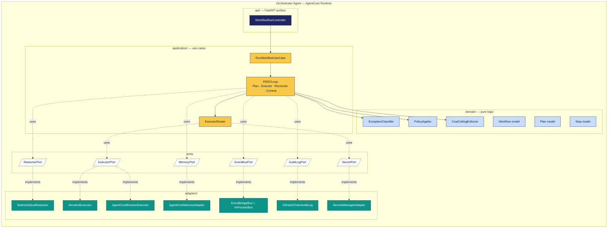

# C4 Level 3 — Orchestrator components

The orchestrator is the most important container in BackOfficePilot. This view shows its
internal components and how they collaborate. Hexagonal architecture (`ADR-002`) is visible
here as a ring: domain in the center, application around it, adapters at the edge.



## Components

### API layer

| Component | Responsibility |
|---|---|
| **WorkflowRunController** | Thin FastAPI router. Receives a "start run" command from EventBridge Scheduler. Delegates to the use case. Returns 202 immediately; the run is async. |

### Application layer

| Component | Responsibility |
|---|---|
| **RunWorkflowUseCase** | Orchestrates a single workflow execution end-to-end. Loads the workflow definition, picks the executor, invokes the PERC loop, ensures commit. |
| **PERCLoop** | The Plan → Execute → Reconcile → Commit state machine. Calls `ReasonerPort` for plan and reconcile; calls `ExecutorPort` for execute; emits domain events at every transition; enforces cost ceiling per iteration. |
| **ExecutorRouter** | Decides which executor to call (`NovaActExecutor` primary, `AgentCoreBrowserExecutor` fallback per `ADR-011`). |

### Domain layer

| Component | Responsibility |
|---|---|
| **Workflow** | Pure model representing the YAML-defined workflow. Validates structure. |
| **Plan** | Pure model representing a Reasoner output: list of steps, success criteria, reasoning trace. |
| **Step** | Pure model for a unit of executor work. |
| **ExceptionClassifier** | Pure logic to bucket exceptions by type and severity. Takes Reasoner output + step result; produces an `Exception` value. |
| **PolicyApplier** | Resolves a policy bundle against a domain decision (e.g. "is this match within tolerance?"). |
| **CostCeilingEnforcer** | Tracks accumulated cost in the current run; signals abort when the per-run cap is exceeded. |

### Ports

| Port | Implementations |
|---|---|
| `ReasonerPort` | `BedrockOpusReasoner` |
| `ExecutorPort` | `NovaActExecutor`, `AgentCoreBrowserExecutor` |
| `MemoryPort` | `AgentCoreMemoryAdapter` |
| `EventBusPort` | `InProcessEventBus` (default), `EventBridgeBus` (fanout) |
| `AuditLogPort` | `S3HashChainAuditLog` |
| `SecretPort` | `SecretsManagerAdapter` |

## Code-level layout

```
src/
├── api/
│   └── workflow_run_controller.py
├── application/
│   ├── run_workflow_use_case.py
│   ├── perc_loop.py
│   └── executor_router.py
├── domain/
│   ├── workflow.py
│   ├── plan.py
│   ├── step.py
│   ├── exception_classifier.py
│   ├── policy_applier.py
│   ├── cost_ceiling.py
│   └── ports.py            # all Port ABCs
└── adapters/
    ├── bedrock/opus_reasoner.py
    ├── novaact/executor.py
    ├── agentcore/{browser_executor,memory_adapter,event_bridge_bus}.py
    ├── audit/s3_hash_chain.py
    └── secrets/secrets_manager_adapter.py
```

## Why this matters

Every behavior in the orchestrator can be traced to one of these components. When a story
implements a new exception category, it touches the `ExceptionClassifier` and one or two
adapters — never the API layer, never the executor adapters. When we add the AgentCore
Identity adapter later, no domain code changes. The architecture is what keeps the spec-driven
discipline tractable.
