# Deployment view — Prod / UAT VPC isolation

```mermaid
flowchart TB
    subgraph Org[AWS Organization · single payer]
      direction TB

      subgraph ProdAcct[AWS Account: backofficepilot-prod]
        direction TB
        subgraph ProdVPC[VPC: 10.10.0.0/16 — us-east-1]
          direction TB
          subgraph ProdPublic[Public subnets]
            ProdALB[ALB / API Gateway]:::pub
          end
          subgraph ProdPrivate[Private subnets]
            ProdLambda[Lambda — control plane]:::priv
            ProdFargate[Fargate — admin jobs]:::priv
          end
          subgraph ProdIsolated[Isolated subnets]
            ProdAgentCore[AgentCore Runtime fleet]:::iso
            ProdGateway[AgentCore Gateway endpoints]:::iso
          end
        end
        ProdDDB[(DynamoDB · Prod tables)]:::store
        ProdS3[(S3 · Prod buckets · Object Lock)]:::store
        ProdKMS[(KMS · Prod CMKs)]:::store
        ProdSecrets[(Secrets Manager · Prod)]:::store
        ProdMemory[(AgentCore Memory · Prod namespace)]:::store
        ProdRegistry[(AgentCore Registry · Prod)]:::store
        ProdObs[(AgentCore Observability · Prod)]:::store
      end

      subgraph UATAcct[AWS Account: backofficepilot-uat]
        direction TB
        subgraph UATVPC[VPC: 10.20.0.0/16 — us-east-1]
          direction TB
          UATALB[ALB / API Gateway]:::pub
          UATLambda[Lambda — control plane]:::priv
          UATFargate[Fargate — admin jobs]:::priv
          UATAgentCore[AgentCore Runtime fleet]:::iso
          UATGateway[AgentCore Gateway endpoints]:::iso
        end
        UATDDB[(DynamoDB · UAT)]:::store
        UATS3[(S3 · UAT)]:::store
        UATKMS[(KMS · UAT CMKs)]:::store
        UATSecrets[(Secrets · UAT)]:::store
        UATMemory[(Memory · UAT)]:::store
        UATRegistry[(Registry · UAT)]:::store
        UATObs[(Observability · UAT)]:::store
      end

      subgraph CIAcct[AWS Account: backofficepilot-ci]
        Deployer[CDK Deploy Role · assume-into target accounts]:::ci
        Artifacts[(S3 · build artifacts)]:::store
      end
    end

    Deployer -->|assume role,<br/>cdk deploy --env prod| ProdAcct
    Deployer -->|assume role,<br/>cdk deploy --env uat| UATAcct

    %% No peering, no transit gateway, no shared subnets across the two account boxes.

    classDef pub fill:#CADCFC,stroke:#0B1F4D,color:#0B1F4D
    classDef priv fill:#F9C846,stroke:#0B1F4D,color:#0B1F4D
    classDef iso fill:#0D9488,stroke:#0B1F4D,color:#fff
    classDef store fill:#fff,stroke:#0B1F4D,color:#0B1F4D,stroke-dasharray:4 2
    classDef ci fill:#1E2761,stroke:#0B1F4D,color:#fff
```



## Account boundaries

| Account | Purpose |
|---|---|
| **backofficepilot-prod** | Customer-facing production. No engineer has standing access; just-in-time access via IAM Identity Center. |
| **backofficepilot-uat** | Internal testing and customer staging. Engineers have read/write. No customer Prod data here, ever. |
| **backofficepilot-ci** | CI/CD only. Stores build artifacts. Holds the deployer role that can assume into Prod and UAT via cross-account trust. |

## Network design

- Each environment has one VPC in `us-east-1` (multi-region in Year 2).
- Three subnet tiers: public (ALB/API Gateway), private (Lambda/Fargate), isolated (AgentCore
  Runtime + Gateway endpoints).
- **No VPC peering, no transit gateway, no PrivateLink between Prod and UAT.**
- Egress through NAT Gateways in private subnets; isolated subnets have no egress (use VPC
  endpoints for AWS services).
- CIDR allocations:
  - Prod: `10.10.0.0/16`
  - UAT: `10.20.0.0/16`
  - Reserved future regions: `10.11.0.0/16`, `10.21.0.0/16`, ...

## Data plane isolation

- DynamoDB tables, S3 buckets, KMS keys, Secrets Manager, AgentCore Memory namespaces,
  AgentCore Registry, AgentCore Observability are all **account-local resources**.
- No cross-account replication of customer data.
- Only the deploy role (in `backofficepilot-ci`) can move artifacts between accounts, and only
  for compiled code, never for customer data.

## Identity

- IAM Identity Center is the directory for human access.
- Service-to-service auth uses IAM roles assumed via instance/task profiles.
- Cross-account assumption is limited to deploy-role-only.
- AgentCore Identity (planned, v2) will propagate end-user identity into agent calls; not yet in
  scope.

## CDK layout

`infra/app.py` defines one CDK app with environment-conditional stacks:

```python
env_prod = cdk.Environment(account="<prod-account-id>", region="us-east-1")
env_uat  = cdk.Environment(account="<uat-account-id>",  region="us-east-1")

NetworkStack(app, "Network-prod", env=env_prod, cidr="10.10.0.0/16")
NetworkStack(app, "Network-uat",  env=env_uat,  cidr="10.20.0.0/16")
DataStack(app, "Data-prod", env=env_prod, ...)
DataStack(app, "Data-uat",  env=env_uat,  ...)
AgentCoreStack(app, "AgentCore-prod", env=env_prod, ...)
AgentCoreStack(app, "AgentCore-uat",  env=env_uat,  ...)
```

A `cdk.context.json` lookup asserts the target account ID at synth time. Deploys to the wrong
account fail before any change is applied.

## Promotion flow

```
local dev → push → CI lint+test → cdk diff (UAT) → review → cdk deploy --env uat
                                                                ↓
                                                  manual approval gate
                                                                ↓
                                                  cdk deploy --env prod
```

The agent code itself is rolled out separately via AgentCore Registry: new versions are pushed
to Registry in UAT, validated, then pushed to Registry in Prod. Rollback is a Registry version
pin.

## Compliance posture

- AWS Config rules enabled per account: required-tags, encryption-at-rest, public-access-block.
- CloudTrail account-wide with S3 + Athena.
- AWS GuardDuty enabled in both accounts.
- AWS Security Hub aggregated to the CI account for monitoring.
- The customer audit story: "Prod is air-gapped from UAT at the account level; here are the
  IAM policies, here is the Config trail, here are the GuardDuty findings."
