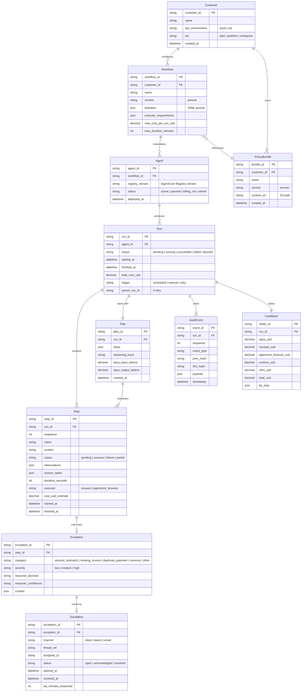

# Core entities and relationships

This document defines the canonical entities in the BackOfficePilot domain. Every entity has a
representation in the domain layer (`src/domain/`) and is persisted via one or more adapters.

## Entity descriptions

### Customer
A BFSI institution that licenses BackOfficePilot. Tier governs feature access.

### Workflow
A versioned YAML definition of an automation procedure. One per (customer, workflow type).
Multiple workflow types per customer (reconciliation, KYC, ...).

### Agent
A deployed instance of a workflow running on AgentCore Runtime. Multiple versions exist over
time; Registry holds the version history. At any moment there is one active version per
workflow.

### Run
A single execution. Has cost, audit, and exception artifacts attached.

### Plan
The Reasoner's output at the start of a run. Immutable once created; replans become new Plans
linked to the parent run.

### Step
A unit of work dispatched to the Executor. Sequenced within a run.

### Exception
A condition the agent flagged as unable to resolve deterministically. Always tied to a step.

### Escalation
The routing of an exception to a human reviewer. Carries SLA timer.

### AuditEvent
Append-only record of every state change in a run. Hash-chained.

### CostMeter
Per-run cost rollup. Updated as the run progresses.

### PolicyBundle
A versioned bundle of markdown files representing the customer's rules. Loaded into the
Reasoner's cached prefix.

## Persistence map

| Entity | Primary store | Reason |
|---|---|---|
| Customer, Workflow, Agent | DynamoDB | Hot path; structured access. |
| Run, Plan, Step | DynamoDB (state) + S3 (run bundle, immutable copy) | DDB for live status, S3 for archive/audit. |
| Exception, Escalation | DynamoDB | Hot path; queue semantics. |
| AuditEvent | S3 + Object Lock (WORM) | Tamper evidence; never updated. |
| CostMeter | DynamoDB + Athena view on Observability events | Live + historical reconciliation. |
| PolicyBundle | S3 + DynamoDB pointer | Bundle in S3, metadata in DDB. |

## Single-table DDB design

DynamoDB uses single-table design with composite keys:

| Access pattern | PK | SK |
|---|---|---|
| Get customer | `CUSTOMER#{id}` | `META` |
| List workflows for customer | `CUSTOMER#{id}` | `WORKFLOW#{wf_id}` |
| Get workflow | `WORKFLOW#{wf_id}` | `META` |
| List agents for workflow | `WORKFLOW#{wf_id}` | `AGENT#{agent_id}` |
| Get run | `RUN#{run_id}` | `META` |
| List steps for run | `RUN#{run_id}` | `STEP#{seq}` |
| List exceptions for run | `RUN#{run_id}` | `EXC#{seq}` |
| Open escalations for customer | `ESCQ#{customer_id}` (GSI) | `OPEN#{opened_at}` |

GSI for cross-cutting queries (open escalations, runs by customer over time window).

## Mutability rules

- Customer, Workflow, Agent: mutable through versioned updates. History via Registry (for Agent)
  and version field (for Workflow).
- Run, Plan, Step: status field is mutable in DDB. Run bundle in S3 is immutable.
- Exception, Escalation: status mutable in DDB; resolution captured as a new AuditEvent.
- AuditEvent: immutable. Never updated, never deleted.
- CostMeter: live tally is mutable in DDB; final value at run end is immutable in S3 run bundle.
